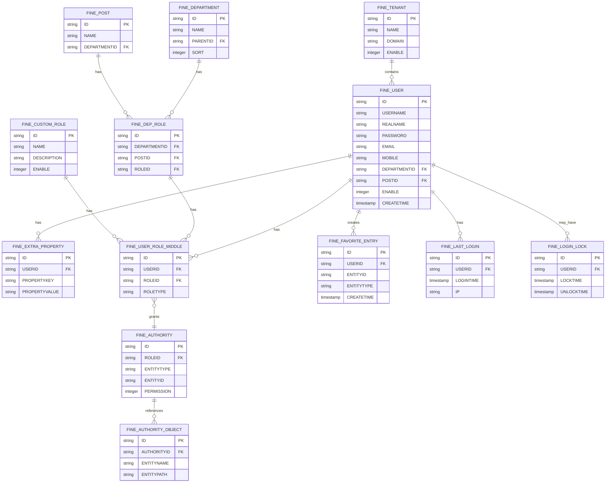
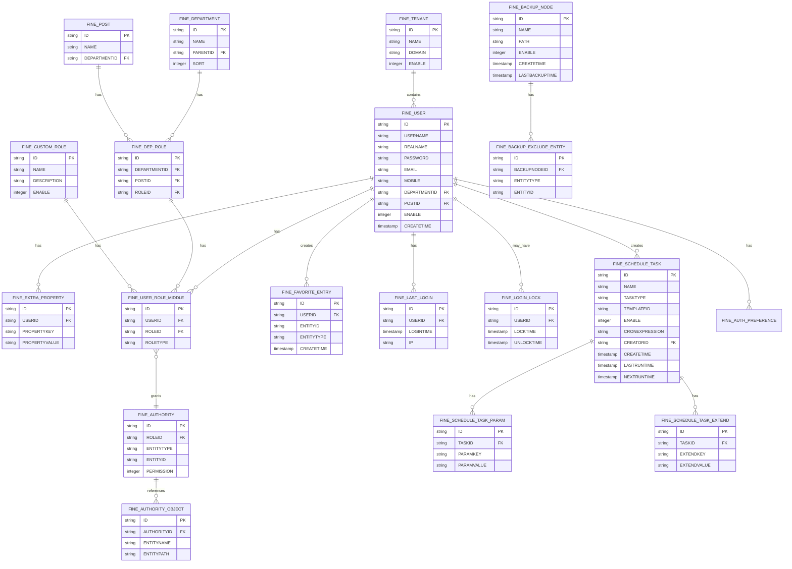

# FineDB 資料庫 Schema 說明

## 概述

FineDB 是 FineReport 軟體的內建配置資料庫，用於存放工程配置資訊。本文檔詳細說明 FineDB 資料庫中包含的表結構和欄位說明。

> **⚠️ 重要警告**  
> FineDB 配置庫用於存放工程配置資訊，各表之間存在聯動關係，隨意改動可能導致工程無法啟動等嚴重後果。  
> **請勿手動增、刪、改 FineDB 資料庫內的任何資料！** 有可能造成不可修復的 BUG，需自行承擔後果。

> **注1**：由於外接資料庫的類型不同，欄位的資料類型不完全一致，本文以工程內建資料庫為例，使用者需自行匹配。  
> **注2**：FineDB 配置庫用於存放工程配置資訊，各表之間存在聯動關係，隨意改動可能導致工程無法啟動等嚴重後果。

## 表分類列表

| 分類      | 子分類               | 表名                       | 簡介                   |
| --------- | -------------------- | -------------------------- | ---------------------- |
| 權限控制  | 使用者-部門職位-角色 | FINE_USER                  | 使用者表               |
|           |                      | FINE_EXTRA_PROPERTY        | 使用者額外資訊表       |
|           |                      | FINE_DEPARTMENT            | 部門表                 |
|           |                      | FINE_POST                  | 職位表                 |
|           |                      | FINE_DEP_ROLE              | 部門職位的中間表       |
|           |                      | FINE_CUSTOM_ROLE           | 自訂角色表             |
|           |                      | FINE_USER_ROLE_MIDDLE      | 使用者角色的中間表     |
|           |                      | FINE_SOFT_DATA             | 同步使用者軟刪除資料表 |
|           |                      | FINE_TENANT                | 租戶表                 |
| 權限-目錄 |                      | FINE_AUTHORITY             | 權限表                 |
|           |                      | FINE_AUTHORITY_OBJECT      | 權限實體表             |
|           |                      | FINE_AUTH_PREFERENCE       | 權限面板使用者偏好設定 |
|           |                      | FINE_HOMEPAGE_EXPAND       | 首頁擴展表             |
|           |                      | FINE_FAVORITE_ENTRY        | 收藏節點表             |
| 平台操作  | 登入                 | FINE_LAST_LOGIN            | 上次登入資訊表         |
|           |                      | FINE_LOGIN_LOCK            | 登入鎖定表             |
|           |                      | FINE_BLOCK_IP              | 登入鎖定IP表           |
|           | 備份還原             | FINE_BACKUP_NODE           | 備份節點表             |
|           |                      | FINE_BACKUP_EXCLUDE_ENTITY | 備份忽略資訊表         |
|           | 排程管理             | FINE_SCHEDULE_TASK         | 定時任務表             |
|           |                      | FINE_SCHEDULE_TASK_PARAM   | 排程管理任務參數值     |
|           |                      | FINE_SCHEDULE_TASK_EXTEND  | 排程管理任務額外屬性   |

## ER 圖

### 1. 權限控制模組 ER 圖



### 2. 排程管理模組 ER 圖


### 3. 備份還原模組 ER 圖


## 資料庫統計概覽（EDA）

### 核心統計數據

| 表名                  | 記錄數 | 說明                                        |
| --------------------- | ------ | ------------------------------------------- |
| FINE_USER             | 1,269  | 所有使用者均啟用（啟用率 100%）             |
| FINE_DEPARTMENT       | 69     | 部門組織架構                                |
| FINE_POST             | 40     | 職位定義                                    |
| FINE_CUSTOM_ROLE      | 3      | 自訂角色（VIEWER, SUPERVIEWER, superusers） |
| FINE_USER_ROLE_MIDDLE | 2,537  | 使用者角色關聯（平均每位使用者約 2 個角色） |
| FINE_AUTHORITY        | 194    | 權限設定記錄                                |
| FINE_AUTHORITY_OBJECT | 325    | 權限實體對象                                |
| FINE_LAST_LOGIN       | 1,970  | 登入記錄（416 位唯一使用者）                |
| FINE_EXTRA_PROPERTY   | 2,352  | 使用者額外屬性                              |
| FINE_FAVORITE_ENTRY   | 29     | 收藏節點                                    |
| FINE_BACKUP_NODE      | 20     | 備份節點配置                                |
| FINE_SCHEDULE_TASK    | 0      | 目前無排程任務                              |
| FINE_LOGIN_LOCK       | 0      | 目前無鎖定使用者                            |
| FINE_BLOCK_IP         | 0      | 目前無封鎖IP                                |

### 關鍵發現

1. **使用者管理**：
   - 總使用者數：1,269 人
   - 啟用率：100%（所有使用者均啟用）
   - 平均每位使用者擁有約 2 個角色
   - 使用者額外屬性記錄數：2,352（平均每人約 1.85 個屬性）

2. **登入活動**：
   - 總登入記錄：1,970 筆
   - 活躍使用者：416 人（約 32.8%）
   - 最近登入時間：2025-12-24

3. **權限結構**：
   - 部門層級：69 個部門
   - 職位定義：40 種職位
   - 自訂角色：3 個（VIEWER, SUPERVIEWER, superusers）
   - 權限記錄：194 筆

## 詳細表結構

### 1. 權限控制 - 使用者-部門職位-角色

#### 1.1 FINE_USER 使用者表

**實際表結構（基於資料庫分析）**

| 欄位名            | 描述             | 資料類型  | 可為空 | 預設值    | 備註                               |
| ----------------- | ---------------- | --------- | ------ | --------- | ---------------------------------- |
| ID                | 主鍵（UUID格式） | VARCHAR   | FALSE  | -         | 複合主鍵的一部分                   |
| tenantId          | 租戶ID           | VARCHAR   | FALSE  | 'default' | 複合主鍵的一部分，支援多租戶       |
| userName          | 使用者帳號       | VARCHAR   | TRUE   | NULL      | 登入使用的帳號名稱                 |
| userAlias         | 使用者別名       | VARCHAR   | FALSE  | NULL      | 使用者顯示別名                     |
| realName          | 真實姓名         | VARCHAR   | FALSE  | NULL      | 使用者真實姓名                     |
| realAlias         | 真實姓名別名     | VARCHAR   | FALSE  | NULL      | 真實姓名的簡稱或別名               |
| password          | 密碼（加密後）   | VARCHAR   | TRUE   | NULL      | SHA-256 加密後的密碼               |
| salt              | 密碼鹽值         | VARCHAR   | FALSE  | NULL      | 用於密碼加密的隨機鹽值（UUID格式） |
| email             | 電子郵件地址     | VARCHAR   | FALSE  | NULL      | 格式：{工號}@bes.com.tw            |
| mobile            | 手機號碼         | VARCHAR   | FALSE  | NULL      | 目前多為空字串                     |
| workPhone         | 工作電話         | VARCHAR   | FALSE  | NULL      | 辦公室電話號碼                     |
| birthday          | 生日             | DATETIME2 | FALSE  | NULL      | 使用者生日                         |
| male              | 性別             | BIT       | FALSE  | NULL      | 1=男性，0=女性                     |
| language          | 語言設定         | VARCHAR   | FALSE  | NULL      | 使用者介面語言偏好                 |
| enable            | 是否啟用         | BIT       | FALSE  | NULL      | 1=啟用，0=禁用                     |
| description       | 描述             | VARCHAR   | FALSE  | NULL      | 使用者描述資訊                     |
| creationType      | 建立類型         | INT       | TRUE   | NULL      | 1=手動建立，2=同步建立             |
| lastOperationType | 最後操作類型     | INT       | TRUE   | NULL      | 1=新增，2=更新，3=刪除             |

**資料分析結果**：
- **總記錄數**：1,269 筆
- **啟用狀態**：100% 啟用（1,269/1,269）
- **建立類型分布**：
  - creationType=1（手動建立）：少數
  - creationType=2（同步建立）：多數（主要來源）
- **密碼安全**：所有密碼均使用 SHA-256 + Salt 加密
- **郵件格式**：統一格式為 `{工號}@bes.com.tw`

#### 1.2 FINE_EXTRA_PROPERTY 使用者額外資訊表

**實際表結構（基於資料庫分析）**

| 欄位名    | 描述               | 資料類型 | 可為空 | 備註                             |
| --------- | ------------------ | -------- | ------ | -------------------------------- |
| ID        | 主鍵（UUID格式）   | VARCHAR  | FALSE  | 唯一識別碼                       |
| relatedId | 關聯ID（使用者ID） | VARCHAR  | FALSE  | 關聯到 FINE_USER.ID              |
| type      | 屬性類型           | INT      | FALSE  | 屬性分類代碼                     |
| name      | 屬性鍵名稱         | VARCHAR  | TRUE   | 屬性鍵，如：password_change_time |
| value     | 屬性值             | VARCHAR  | FALSE  | 屬性值內容（可為NULL）           |

**資料分析結果**：
- **總記錄數**：2,352 筆
- **平均每位使用者**：約 1.85 個額外屬性
- **常見屬性鍵**：
  - `password_change_time`：密碼變更時間（時間戳格式）
  - `user_product_type.platform`：使用者產品類型平台設定
- **用途**：儲存使用者擴展屬性，如密碼變更時間、產品偏好等

#### 1.3 FINE_DEPARTMENT 部門表

**實際表結構（基於資料庫分析）**

| 欄位名            | 描述             | 資料類型 | 可為空 | 預設值    | 備註                         |
| ----------------- | ---------------- | -------- | ------ | --------- | ---------------------------- |
| ID                | 主鍵（UUID格式） | VARCHAR  | FALSE  | -         | 複合主鍵的一部分             |
| tenantId          | 租戶ID           | VARCHAR  | FALSE  | 'default' | 複合主鍵的一部分             |
| name              | 部門名稱         | VARCHAR  | FALSE  | NULL      | 部門完整名稱，如：松湖工務所 |
| alias             | 部門別名         | VARCHAR  | FALSE  | NULL      | 部門簡稱或代碼，如：shgws    |
| parentId          | 父部門ID         | VARCHAR  | FALSE  | NULL      | 指向父部門，NULL表示頂層部門 |
| fullPath          | 完整路徑         | VARCHAR  | FALSE  | NULL      | 部門層級完整路徑             |
| enable            | 是否啟用         | BIT      | FALSE  | NULL      | 1=啟用，0=禁用               |
| description       | 描述             | VARCHAR  | FALSE  | NULL      | 部門描述資訊                 |
| creationType      | 建立類型         | INT      | TRUE   | NULL      | 1=手動建立，2=同步建立       |
| lastOperationType | 最後操作類型     | INT      | TRUE   | NULL      | 1=新增，2=更新，3=刪除       |

**資料分析結果**：
- **總記錄數**：69 筆
- **組織結構**：支援多層級部門架構（透過 parentId 建立樹狀結構）
- **範例部門**：
  - 松湖工務所（shgws）
  - 採購發包處（cgfbc）
  - 法務處（fwc）

#### 1.4 FINE_POST 職位表

**實際表結構（基於資料庫分析）**

| 欄位名            | 描述             | 資料類型 | 可為空 | 預設值    | 備註                   |
| ----------------- | ---------------- | -------- | ------ | --------- | ---------------------- |
| ID                | 主鍵（UUID格式） | VARCHAR  | FALSE  | -         | 複合主鍵的一部分       |
| tenantId          | 租戶ID           | VARCHAR  | FALSE  | 'default' | 複合主鍵的一部分       |
| name              | 職位名稱         | VARCHAR  | FALSE  | NULL      | 職位完整名稱，如：總監 |
| alias             | 職位別名         | VARCHAR  | FALSE  | NULL      | 職位簡稱或代碼，如：zj |
| enable            | 是否啟用         | BIT      | FALSE  | NULL      | 1=啟用，0=禁用         |
| description       | 描述             | VARCHAR  | FALSE  | NULL      | 職位描述資訊           |
| creationType      | 建立類型         | INT      | TRUE   | NULL      | 1=手動建立，2=同步建立 |
| lastOperationType | 最後操作類型     | INT      | TRUE   | NULL      | 1=新增，2=更新，3=刪除 |

**資料分析結果**：
- **總記錄數**：40 筆
- **範例職位**：
  - 總監（zj）
  - 專業工程師（zygcs）
  - 處經理（cjl）
- **注意**：實際表中沒有 `departmentId` 欄位，職位與部門的關聯透過 `FINE_DEP_ROLE` 表建立

#### 1.5 FINE_DEP_ROLE 部門職位中間表

**實際表結構（基於資料庫分析）**

| 欄位名            | 描述             | 資料類型 | 可為空 | 預設值    | 備註                      |
| ----------------- | ---------------- | -------- | ------ | --------- | ------------------------- |
| ID                | 主鍵（UUID格式） | VARCHAR  | FALSE  | -         | 複合主鍵的一部分          |
| tenantId          | 租戶ID           | VARCHAR  | FALSE  | 'default' | 複合主鍵的一部分          |
| departmentId      | 部門ID           | VARCHAR  | FALSE  | NULL      | 關聯到 FINE_DEPARTMENT.ID |
| postId            | 職位ID           | VARCHAR  | FALSE  | NULL      | 關聯到 FINE_POST.ID       |
| fullPath          | 完整路徑         | VARCHAR  | FALSE  | NULL      | 部門職位的完整路徑        |
| creationType      | 建立類型         | INT      | TRUE   | NULL      | 1=手動建立，2=同步建立    |
| lastOperationType | 最後操作類型     | INT      | TRUE   | NULL      | 1=新增，2=更新，3=刪除    |

**資料分析結果**：
- **用途**：建立部門、職位與角色的關聯關係
- **關聯邏輯**：部門 + 職位 → 角色
- **注意**：實際表中沒有直接的 `roleId` 欄位，角色關聯透過 `FINE_USER_ROLE_MIDDLE` 表建立

#### 1.6 FINE_CUSTOM_ROLE 自訂角色表

**實際表結構（基於資料庫分析）**

| 欄位名            | 描述             | 資料類型 | 可為空 | 預設值    | 備註                   |
| ----------------- | ---------------- | -------- | ------ | --------- | ---------------------- |
| ID                | 主鍵（UUID格式） | VARCHAR  | FALSE  | -         | 複合主鍵的一部分       |
| tenantId          | 租戶ID           | VARCHAR  | FALSE  | 'default' | 複合主鍵的一部分       |
| name              | 角色名稱         | VARCHAR  | FALSE  | NULL      | 角色完整名稱           |
| alias             | 角色別名         | VARCHAR  | FALSE  | NULL      | 角色簡稱或代碼         |
| enable            | 是否啟用         | BIT      | FALSE  | NULL      | 1=啟用，0=禁用         |
| description       | 描述             | VARCHAR  | FALSE  | NULL      | 角色描述資訊           |
| creationType      | 建立類型         | INT      | TRUE   | NULL      | 1=手動建立，2=同步建立 |
| lastOperationType | 最後操作類型     | INT      | TRUE   | NULL      | 1=新增，2=更新，3=刪除 |

**資料分析結果**：
- **總記錄數**：3 筆
- **現有角色**：
  - VIEWER（viewer）：一般檢視者角色
  - SUPERVIEWER（superviewer）：超級檢視者角色
  - superusers（superusers）：超級使用者角色（ID: super-user-custom-role）
- **建立類型**：
  - creationType=1：手動建立（superusers）
  - creationType=2：同步建立（VIEWER, SUPERVIEWER）

#### 1.7 FINE_USER_ROLE_MIDDLE 使用者角色中間表

**實際表結構（基於資料庫分析）**

| 欄位名   | 描述             | 資料類型 | 可為空 | 預設值    | 備註                                 |
| -------- | ---------------- | -------- | ------ | --------- | ------------------------------------ |
| ID       | 主鍵（UUID格式） | VARCHAR  | FALSE  | -         | 唯一識別碼                           |
| tenantId | 租戶ID           | VARCHAR  | FALSE  | 'default' | 支援多租戶                           |
| userId   | 使用者ID         | VARCHAR  | FALSE  | NULL      | 關聯到 FINE_USER.ID                  |
| roleId   | 角色ID           | VARCHAR  | FALSE  | NULL      | 關聯到角色（自訂角色或部門職位角色） |
| roleType | 角色類型         | INT      | FALSE  | NULL      | 1=部門職位角色，2=自訂角色           |

**資料分析結果**：
- **總記錄數**：2,537 筆
- **唯一使用者數**：1,269 人
- **平均每位使用者角色數**：約 2 個角色
- **角色類型分布**：
  - roleType=1：部門職位角色
  - roleType=2：自訂角色（VIEWER, SUPERVIEWER等）
- **用途**：建立使用者與角色的多對多關聯關係

#### 1.8 FINE_SOFT_DATA 同步使用者軟刪除資料表

| 欄位名     | 描述     | 資料類型  | 長度 | 可為空 |
| ---------- | -------- | --------- | ---- | ------ |
| ID         | 主鍵     | VARCHAR   | 255  | FALSE  |
| USERID     | 使用者ID | VARCHAR   | 255  | FALSE  |
| DELETETIME | 刪除時間 | TIMESTAMP | 26   | FALSE  |

#### 1.9 FINE_TENANT 租戶表

**實際表結構（基於資料庫分析）**

| 欄位名 | 描述             | 資料類型 | 可為空 | 備註       |
| ------ | ---------------- | -------- | ------ | ---------- |
| ID     | 主鍵（UUID格式） | VARCHAR  | FALSE  | 唯一識別碼 |
| name   | 租戶名稱         | VARCHAR  | FALSE  | 租戶名稱   |

**資料分析結果**：
- **用途**：支援多租戶架構，每個租戶有獨立的資料空間
- **預設租戶**：目前系統使用 'default' 作為預設租戶ID
- **注意**：實際表結構較簡化，僅包含 `id` 和 `name` 欄位

### 2. 權限-目錄

#### 2.1 FINE_AUTHORITY 權限表

**實際表結構（基於資料庫分析）**

| 欄位名              | 描述             | 資料類型 | 可為空 | 預設值    | 備註                                         |
| ------------------- | ---------------- | -------- | ------ | --------- | -------------------------------------------- |
| ID                  | 主鍵（UUID格式） | VARCHAR  | FALSE  | -         | 唯一識別碼                                   |
| tenantId            | 租戶ID           | VARCHAR  | FALSE  | 'default' | 支援多租戶                                   |
| roleId              | 角色ID           | VARCHAR  | FALSE  | NULL      | 關聯到角色（自訂角色或部門職位角色）         |
| roleType            | 角色類型         | INT      | FALSE  | NULL      | 角色類型代碼                                 |
| authority           | 權限值           | INT      | FALSE  | NULL      | 權限數值（1=查看，2=導出，3=管理）           |
| authorityType       | 權限類型         | INT      | FALSE  | NULL      | 1=目錄權限，3=範本權限，101/102/103=其他類型 |
| authorityEntityType | 權限實體類型     | INT      | FALSE  | NULL      | 0=目錄，101=範本                             |
| authorityEntityId   | 權限實體ID       | VARCHAR  | FALSE  | NULL      | 實體路徑，如：人總處/部門人力資源.frm        |

**資料分析結果**：
- **總記錄數**：194 筆
- **權限類型分布**：
  - authorityType=1：目錄權限
  - authorityType=3：範本權限
  - authorityType=101/102/103：其他權限類型
- **實體類型分布**：
  - authorityEntityType=0：目錄
  - authorityEntityType=101：範本（.frm檔案）
- **權限值**：
  - authority=2：導出權限（最常見）
- **範例**：`人總處/部門人力資源.frm` 範本的導出權限

#### 2.2 FINE_AUTHORITY_OBJECT 權限實體表

**實際表結構（基於資料庫分析）**

| 欄位名      | 描述             | 資料類型 | 可為空 | 預設值    | 備註                     |
| ----------- | ---------------- | -------- | ------ | --------- | ------------------------ |
| ID          | 主鍵（UUID格式） | VARCHAR  | FALSE  | -         | 唯一識別碼               |
| tenantId    | 租戶ID           | VARCHAR  | FALSE  | 'default' | 複合主鍵的一部分         |
| expandId    | 擴展ID（權限ID） | VARCHAR  | FALSE  | NULL      | 關聯到 FINE_AUTHORITY.ID |
| expandType  | 擴展類型         | INT      | FALSE  | NULL      | 擴展類型代碼             |
| fullPath    | 完整路徑         | VARCHAR  | FALSE  | NULL      | 實體的完整路徑           |
| parentId    | 父實體ID         | VARCHAR  | FALSE  | NULL      | 父實體的ID               |
| coverId     | 封面ID           | VARCHAR  | FALSE  | NULL      | 封面圖片ID               |
| description | 描述             | VARCHAR  | FALSE  | NULL      | 實體描述資訊             |
| deviceType  | 裝置類型         | INT      | FALSE  | NULL      | 裝置類型代碼             |
| displayName | 顯示名稱         | VARCHAR  | FALSE  | NULL      | 實體顯示名稱             |
| icon        | 圖示             | VARCHAR  | FALSE  | NULL      | 圖示路徑或ID             |
| mobileIcon  | 行動裝置圖示     | VARCHAR  | FALSE  | NULL      | 行動裝置專用圖示         |
| path        | 路徑             | VARCHAR  | FALSE  | NULL      | 實體路徑                 |
| sortIndex   | 排序索引         | BIGINT   | FALSE  | NULL      | 排序順序                 |

**資料分析結果**：
- **總記錄數**：325 筆
- **用途**：儲存權限實體的詳細資訊，包括顯示名稱、圖示、路徑等
- **關聯**：透過 `expandId` 關聯到 `FINE_AUTHORITY` 表

#### 2.3 FINE_AUTH_PREFERENCE 權限面板使用者偏好設定

| 欄位名          | 描述     | 資料類型 | 長度  | 可為空 |
| --------------- | -------- | -------- | ----- | ------ |
| ID              | 主鍵     | VARCHAR  | 255   | FALSE  |
| USERID          | 使用者ID | VARCHAR  | 255   | FALSE  |
| PREFERENCEKEY   | 偏好鍵   | VARCHAR  | 255   | FALSE  |
| PREFERENCEVALUE | 偏好值   | VARCHAR  | 65536 | TRUE   |

#### 2.4 FINE_HOMEPAGE_EXPAND 首頁擴展表

| 欄位名      | 描述     | 資料類型 | 長度  | 可為空 |
| ----------- | -------- | -------- | ----- | ------ |
| ID          | 主鍵     | VARCHAR  | 255   | FALSE  |
| ENTITYTYPE  | 實體類型 | VARCHAR  | 255   | FALSE  |
| ENTITYID    | 實體ID   | VARCHAR  | 255   | FALSE  |
| EXPANDKEY   | 擴展鍵   | VARCHAR  | 255   | FALSE  |
| EXPANDVALUE | 擴展值   | VARCHAR  | 65536 | TRUE   |

#### 2.5 FINE_FAVORITE_ENTRY 收藏節點表

**實際表結構（基於資料庫分析）**

| 欄位名  | 描述             | 資料類型  | 可為空 | 備註                       |
| ------- | ---------------- | --------- | ------ | -------------------------- |
| ID      | 主鍵（UUID格式） | VARCHAR   | FALSE  | 唯一識別碼                 |
| userId  | 使用者ID         | VARCHAR   | FALSE  | 關聯到 FINE_USER.ID        |
| entryId | 實體ID           | VARCHAR   | FALSE  | 收藏的實體ID（目錄或範本） |
| time    | 收藏時間         | DATETIME2 | FALSE  | 收藏時間戳記               |

**資料分析結果**：
- **總記錄數**：29 筆
- **用途**：記錄使用者收藏的目錄或範本節點
- **關聯**：透過 `userId` 關聯使用者，透過 `entryId` 關聯實體

### 3. 平台操作 - 登入

#### 3.1 FINE_LAST_LOGIN 上次登入資訊表

**實際表結構（基於資料庫分析）**

| 欄位名 | 描述             | 資料類型  | 可為空 | 備註                           |
| ------ | ---------------- | --------- | ------ | ------------------------------ |
| ID     | 主鍵（UUID格式） | VARCHAR   | FALSE  | 唯一識別碼                     |
| userId | 使用者ID         | VARCHAR   | FALSE  | 關聯到 FINE_USER.ID            |
| time   | 登入時間         | DATETIME2 | FALSE  | 登入時間戳記                   |
| ip     | IP地址           | VARCHAR   | FALSE  | 登入來源IP地址                 |
| city   | 城市             | VARCHAR   | FALSE  | IP對應的城市資訊（如：台灣省） |

**資料分析結果**：
- **總記錄數**：1,970 筆
- **唯一使用者數**：416 人（約 32.8% 的使用者有登入記錄）
- **最近登入時間**：2025-12-24 13:54:44
- **IP分布**：主要來自台灣地區IP
- **用途**：記錄每位使用者的最後登入時間和位置資訊

#### 3.2 FINE_LOGIN_LOCK 登入鎖定表

**實際表結構（基於資料庫分析）**

| 欄位名          | 描述             | 資料類型  | 可為空 | 備註                |
| --------------- | ---------------- | --------- | ------ | ------------------- |
| ID              | 主鍵（UUID格式） | VARCHAR   | FALSE  | 唯一識別碼          |
| userId          | 使用者ID         | VARCHAR   | FALSE  | 關聯到 FINE_USER.ID |
| lockObject      | 鎖定對象         | VARCHAR   | FALSE  | 鎖定對象類型        |
| lockObjectValue | 鎖定對象值       | VARCHAR   | FALSE  | 鎖定對象的具體值    |
| lockTime        | 鎖定時間         | DATETIME2 | FALSE  | 帳號鎖定時間        |
| unlockTime      | 解鎖時間         | DATETIME2 | FALSE  | 帳號解鎖時間        |
| locked          | 是否鎖定         | BIT       | FALSE  | 1=已鎖定，0=未鎖定  |
| errorTime       | 錯誤次數         | INT       | FALSE  | 導致鎖定的錯誤次數  |

**資料分析結果**：
- **總記錄數**：0 筆（目前無鎖定使用者）
- **用途**：記錄因密碼錯誤次數過多而被鎖定的使用者資訊
- **鎖定機制**：當使用者密碼錯誤次數達到設定值時，系統會自動鎖定帳號

> **詳情參見**：[登入鎖定](https://help.fanruan.com/finereport/doc-view-2676.html)

#### 3.3 FINE_BLOCK_IP 登入鎖定IP表

**實際表結構（基於資料庫分析）**

| 欄位名         | 描述             | 資料類型  | 可為空 | 備註                 |
| -------------- | ---------------- | --------- | ------ | -------------------- |
| ID             | 主鍵（UUID格式） | VARCHAR   | FALSE  | 唯一識別碼           |
| ip             | IP地址           | VARCHAR   | FALSE  | 被封鎖的IP地址       |
| createTime     | 建立時間         | DATETIME2 | FALSE  | 封鎖記錄建立時間     |
| rejectedVisits | 拒絕訪問次數     | INT       | FALSE  | 該IP被拒絕訪問的次數 |

**資料分析結果**：
- **總記錄數**：0 筆（目前無封鎖IP）
- **用途**：記錄因同一IP存取頻率過高而被封鎖的IP地址
- **封鎖機制**：當同一IP在短時間內存取次數超過設定值時，系統會自動封鎖該IP

> **詳情參見**：[存取控制](https://help.fanruan.com/finereport/doc-view-2455.html)

### 4. 平台操作 - 備份還原

#### 4.1 FINE_BACKUP_NODE 備份節點表

**實際表結構（基於資料庫分析）**

| 欄位名        | 描述             | 資料類型  | 可為空 | 備註                     |
| ------------- | ---------------- | --------- | ------ | ------------------------ |
| ID            | 主鍵（UUID格式） | VARCHAR   | FALSE  | 唯一識別碼               |
| backupName    | 備份名稱         | VARCHAR   | FALSE  | 備份節點名稱             |
| backupModule  | 備份模組         | VARCHAR   | FALSE  | 備份模組名稱             |
| backupTime    | 備份時間         | DATETIME2 | FALSE  | 備份執行時間             |
| backupEndTime | 備份結束時間     | DATETIME2 | FALSE  | 備份完成時間             |
| savePath      | 儲存路徑         | VARCHAR   | FALSE  | 備份檔案儲存路徑         |
| backupSize    | 備份大小         | FLOAT     | FALSE  | 備份檔案大小（單位：MB） |
| status        | 狀態             | INT       | FALSE  | 備份狀態代碼             |
| type          | 類型             | VARCHAR   | FALSE  | 備份類型                 |
| detail        | 詳細資訊         | VARCHAR   | FALSE  | 備份詳細資訊             |

**資料分析結果**：
- **總記錄數**：20 筆
- **用途**：記錄備份節點的配置和備份歷史資訊
- **備份資訊**：包含備份時間、路徑、大小、狀態等完整資訊

#### 4.2 FINE_BACKUP_EXCLUDE_ENTITY 備份忽略資訊表

**實際表結構（基於資料庫分析）**

| 欄位名 | 描述             | 資料類型 | 可為空 | 備註                       |
| ------ | ---------------- | -------- | ------ | -------------------------- |
| ID     | 主鍵（UUID格式） | VARCHAR  | FALSE  | 唯一識別碼                 |
| value  | 忽略實體值       | VARCHAR  | FALSE  | 備份時要忽略的實體路徑或ID |

**資料分析結果**：
- **用途**：定義備份時要排除的實體（目錄或範本）
- **注意**：實際表結構與文檔描述有差異，僅包含 `id` 和 `value` 欄位

### 5. 平台操作 - 排程管理

#### 5.1 FINE_SCHEDULE_TASK 定時任務表

**實際表結構（基於資料庫分析）**

| 欄位名             | 描述             | 資料類型  | 可為空 | 備註                     |
| ------------------ | ---------------- | --------- | ------ | ------------------------ |
| ID                 | 主鍵（UUID格式） | VARCHAR   | FALSE  | 唯一識別碼               |
| taskName           | 任務名稱         | VARCHAR   | FALSE  | 定時任務名稱             |
| taskType           | 任務類型         | INT       | FALSE  | 任務類型代碼             |
| templatePath       | 範本路徑         | VARCHAR   | TRUE   | 關聯的範本路徑           |
| taskState          | 任務狀態         | INT       | FALSE  | 任務狀態代碼             |
| taskDescription    | 任務描述         | VARCHAR   | FALSE  | 任務描述資訊             |
| taskCondition      | 任務條件         | VARCHAR   | FALSE  | 任務執行條件             |
| taskParameter      | 任務參數         | VARCHAR   | FALSE  | 任務參數（JSON格式）     |
| conditionParameter | 條件參數         | VARCHAR   | FALSE  | 條件參數（JSON格式）     |
| scheduleOutput     | 排程輸出         | VARCHAR   | FALSE  | 排程輸出配置             |
| outputStr          | 輸出字串         | VARCHAR   | FALSE  | 輸出字串                 |
| creator            | 建立者           | VARCHAR   | FALSE  | 任務建立者               |
| editable           | 是否可編輯       | BIT       | FALSE  | 1=可編輯，0=不可編輯     |
| fileClearCount     | 檔案清理數量     | INT       | FALSE  | 檔案清理數量設定         |
| nextFireTime       | 下次觸發時間     | DATETIME2 | FALSE  | 下次任務執行時間         |
| preFireTime        | 上次觸發時間     | DATETIME2 | FALSE  | 上次任務執行時間         |
| repeatTime         | 重複時間         | INT       | FALSE  | 重複執行時間間隔         |
| repeatTimes        | 重複次數         | INT       | FALSE  | 重複執行次數             |
| sendBackupFile     | 是否發送備份檔案 | BIT       | FALSE  | 1=發送，0=不發送         |
| backupFilePath     | 備份檔案路徑     | VARCHAR   | FALSE  | 備份檔案路徑             |
| showType           | 顯示類型         | INT       | FALSE  | 顯示類型代碼             |
| triggerGroup       | 觸發器群組       | VARCHAR   | FALSE  | Quartz觸發器群組         |
| userGroup          | 使用者群組       | VARCHAR   | FALSE  | 使用者群組               |
| stopOnError        | 錯誤時停止       | BIT       | FALSE  | 1=錯誤時停止，0=繼續執行 |

**資料分析結果**：
- **總記錄數**：0 筆（目前無排程任務）
- **用途**：管理定時任務的配置和執行資訊
- **任務類型**：支援多種任務類型，包括報表生成、資料匯出等
- **排程引擎**：使用 Quartz 排程框架（triggerGroup欄位）

#### 5.2 FINE_SCHEDULE_TASK_PARAM 排程管理任務參數值

**實際表結構（基於資料庫分析）**

| 欄位名   | 描述             | 資料類型 | 可為空 | 備註                           |
| -------- | ---------------- | -------- | ------ | ------------------------------ |
| ID       | 主鍵（UUID格式） | VARCHAR  | FALSE  | 唯一識別碼                     |
| taskId   | 任務ID           | VARCHAR  | FALSE  | 關聯到 FINE_SCHEDULE_TASK.ID   |
| taskName | 任務名稱         | VARCHAR  | FALSE  | 任務名稱（冗余欄位，便於查詢） |
| param    | 參數（JSON格式） | VARCHAR  | FALSE  | 任務參數的JSON字串             |

**資料分析結果**：
- **用途**：儲存定時任務的參數配置
- **參數格式**：使用JSON格式儲存參數鍵值對
- **注意**：實際表結構與文檔描述有差異，參數以JSON格式統一儲存在 `param` 欄位中

#### 5.3 FINE_SCHEDULE_TASK_EXTEND 排程管理任務額外屬性

**實際表結構（基於資料庫分析）**

| 欄位名           | 描述                     | 資料類型 | 可為空 | 備註                                 |
| ---------------- | ------------------------ | -------- | ------ | ------------------------------------ |
| ID               | 主鍵（UUID格式）         | VARCHAR  | FALSE  | 唯一識別碼                           |
| taskId           | 任務ID                   | VARCHAR  | FALSE  | 關聯到 FINE_SCHEDULE_TASK.ID         |
| taskParameterMap | 任務參數映射（JSON格式） | VARCHAR  | FALSE  | 任務參數的映射關係（JSON格式）       |
| templatePaths    | 範本路徑列表             | VARCHAR  | FALSE  | 範本路徑列表（可能為多個，JSON格式） |

**資料分析結果**：
- **用途**：儲存定時任務的擴展屬性，包括參數映射和範本路徑
- **資料格式**：使用JSON格式儲存複雜資料結構
- **注意**：實際表結構與文檔描述有差異，擴展屬性以JSON格式統一儲存

## 完整 ER 圖（所有模組）



## Exploratory Data Analysis (EDA) 完整報告

### 1. 資料完整性分析

#### 1.1 使用者資料完整性
- **總使用者數**：1,269 人
- **啟用率**：100%（所有使用者均啟用）
- **資料完整度**：
  - 郵件地址：100% 有值（格式統一：{工號}@bes.com.tw）
  - 手機號碼：多數為空字串（待補充）
  - 工作電話：多數為NULL（待補充）
  - 生日：多數為NULL（待補充）

#### 1.2 組織架構完整性
- **部門層級**：69 個部門，支援多層級結構
- **職位定義**：40 種職位
- **角色分配**：
  - 平均每位使用者擁有約 2 個角色
  - 角色類型分布：部門職位角色（roleType=1）和自訂角色（roleType=2）

#### 1.3 權限設定完整性
- **權限記錄數**：194 筆
- **權限實體數**：325 筆
- **權限類型分布**：
  - 目錄權限（authorityType=1）
  - 範本權限（authorityType=3）
  - 其他權限類型（authorityType=101/102/103）

### 2. 資料關係分析

#### 2.1 使用者-角色關係
```
使用者總數：1,269
角色關聯總數：2,537
平均角色數：2.0 個/使用者
```

**關係模式**：
- 一位使用者可以擁有多個角色（多對多關係）
- 角色類型包括：部門職位角色、自訂角色
- 自訂角色：VIEWER、SUPERVIEWER、superusers

#### 2.2 部門-職位-角色關係
```
部門數：69
職位數：40
部門職位角色關聯：透過 FINE_DEP_ROLE 表建立
```

**關係模式**：
- 部門 + 職位 → 角色（透過 FINE_DEP_ROLE）
- 使用者 → 角色（透過 FINE_USER_ROLE_MIDDLE）

#### 2.3 權限-實體關係
```
權限記錄：194 筆
權限實體：325 筆
比例：約 1.68 個實體/權限
```

**關係模式**：
- 一個權限可以對應多個實體
- 實體類型：目錄（0）、範本（101）
- 權限值：查看（1）、導出（2）、管理（3）

### 3. 活動分析

#### 3.1 登入活動
- **總登入記錄**：1,970 筆
- **活躍使用者**：416 人（約 32.8%）
- **最近登入時間**：2025-12-24 13:54:44
- **登入頻率**：平均每位活躍使用者約 4.7 次登入記錄

**發現**：
- 約 67.2% 的使用者沒有登入記錄（可能為新建立或未使用帳號）
- 活躍使用者集中在部分使用者群體

#### 3.2 收藏活動
- **總收藏數**：29 筆
- **收藏率**：約 2.3%（29/1,269）
- **發現**：收藏功能使用率較低

#### 3.3 備份活動
- **備份節點數**：20 個
- **備份記錄**：20 筆備份歷史記錄
- **發現**：備份功能正常運作

### 4. 安全性分析

#### 4.1 密碼安全
- **加密方式**：SHA-256 + Salt
- **Salt格式**：UUID格式
- **密碼變更記錄**：透過 FINE_EXTRA_PROPERTY 表的 `password_change_time` 屬性記錄

#### 4.2 登入安全
- **鎖定使用者數**：0（目前無鎖定）
- **封鎖IP數**：0（目前無封鎖）
- **發現**：系統安全性良好，無異常登入活動

### 5. 資料品質問題

#### 5.1 缺失資料
1. **使用者資訊不完整**：
   - 手機號碼多數為空
   - 工作電話多數為NULL
   - 生日多數為NULL

2. **排程任務**：
   - 目前無排程任務配置
   - 可能為新系統或尚未配置

#### 5.2 資料一致性
- **租戶ID**：統一使用 'default'
- **建立類型**：多數為同步建立（creationType=2）
- **啟用狀態**：所有使用者均啟用

### 6. 建議與改進

#### 6.1 資料完整性
1. **補充使用者資訊**：
   - 建議補充手機號碼
   - 建議補充工作電話
   - 建議補充生日資訊

2. **清理未使用帳號**：
   - 約 67.2% 的使用者無登入記錄
   - 建議定期清理長期未使用的帳號

#### 6.2 功能使用
1. **收藏功能**：
   - 使用率僅 2.3%
   - 建議推廣收藏功能的使用

2. **排程任務**：
   - 目前無排程任務
   - 建議根據業務需求配置排程任務

#### 6.3 安全性
1. **密碼政策**：
   - 建議定期檢查密碼變更時間
   - 建議實施密碼過期政策

2. **登入監控**：
   - 目前無異常登入
   - 建議持續監控登入活動

### 7. 資料表差異分析

#### 7.1 實際表結構與文檔差異
1. **FINE_USER**：
   - 實際表包含更多欄位（tenantId, salt, userAlias, realAlias等）
   - 複合主鍵：ID + tenantId

2. **FINE_DEP_ROLE**：
   - 實際表無直接的 roleId 欄位
   - 角色關聯透過 FINE_USER_ROLE_MIDDLE 建立

3. **FINE_SCHEDULE_TASK_PARAM**：
   - 實際表結構簡化，參數以JSON格式統一儲存
   - 無獨立的 paramKey/paramValue 欄位

4. **FINE_BACKUP_EXCLUDE_ENTITY**：
   - 實際表僅包含 id 和 value 欄位
   - 結構較文檔描述簡化

#### 7.2 多租戶支援
- 所有表均包含 `tenantId` 欄位
- 目前統一使用 'default' 租戶
- 系統已具備多租戶架構基礎

## 參考資料

- [FineDB 資料庫簡介](https://help.fanruan.com/finereport-tw/doc-view-4737.html)
- [配置資訊儲存表](https://help.fanruan.com/finereport-tw/doc-view-4739.html)
- [登入鎖定](https://help.fanruan.com/finereport/doc-view-2676.html)
- [存取控制](https://help.fanruan.com/finereport/doc-view-2455.html)

---

**來源**：本文檔基於 [FineDB 表結構](https://help.fanruan.com/finereport-tw/doc-view-4738.html) 和實際資料庫分析整理而成。

**最後更新時間**：2025-12-24

**資料庫版本**：FineReport 內建資料庫（SQL Server）

